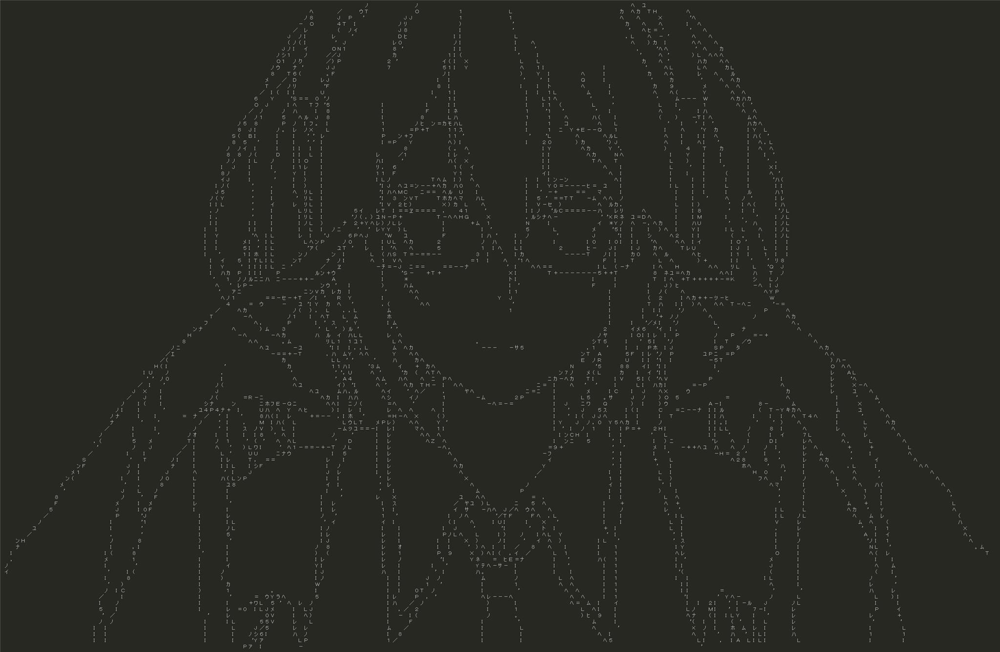

# asciiko
--------------------------------------------------------------------------------
A deep ascii art generator. Job done during MSR Montreal hackathon 2018. This is an on-going project, it's not finished.

## Requirements
* Python 2/3
* Install Pytorch, follow [this][pytorch_install].
* Install OpenCV2, `conda install opencv` should work.
* Ask for permission of using ETL (a Japanese handwritten character recognition dataset) from [here][etlcdb], then unzip and put ETL1 or ETL6 inside `asciiko/` (we recommend using ETL6, which contains more punctuation marks, they might be helpful for generating ascii arts).

## First Time Running
It will take some time if you run the first time, asciiko will preprocess and parse the ETL datasets, save the useful part into .npy files.

## To Run
* In `config/config.yaml`, enable CUDA if you have access to it, also specify which split of ETL data are you using.
* To train a model, run `python train.py -c config/`.
* To generate ascii strings from an image, modify and run `python img2charid.py`, it will generate a `.json` file;
* To generate ascii strings from a video, run `python utils/get_video_frames.py`, to get all frames of a video into a folder, then modify and run `python img2charid.py`, it will generate a `.json` file.
* To render the ascii arts, run `python char_classifier/renderer.py`, with your `.json` file specified inside.
* a pretrained model is provided in `saved_models/`.

## Image Processing
Image processing is an important step before generating ascii arts, and the performance of the latter steps are highly relying on how good the images are processed, i.e., how good the edges are extracted. To our knowledge there's no 'panacea' for all input images/videos, so depending on which specific image or video you are using, sometimes you need to massage your edge detector carefully. Thanks to OpenCV, one can do some standard image processing tricks in one line of python code. We provide code to help tweaking your edge detector in `utils/`.

## Demo
* 

* [nichijou op, pic in pic][pic_in_pic]
* [nichijou op, up and down][up_down]

## Authors
[eric yuan][eryua], [@oya0306][tatsuro], [@penzant][saku]

## LICENSE
[GLWTPL][goodluck]

[pytorch_install]: http://pytorch.org/
[etlcdb]: http://etlcdb.db.aist.go.jp/
[up_down]: https://youtu.be/_pJyuo-ivR4/
[pic_in_pic]: https://youtu.be/i2fxoowtu1A/
[eryua]: https://github.com/xingdi-eric-yuan
[tatsuro]: https://github.com/oya0306
[saku]: https://github.com/penzant
[goodluck]: https://github.com/xingdi-eric-yuan/asciiko/blob/master/LICENSE